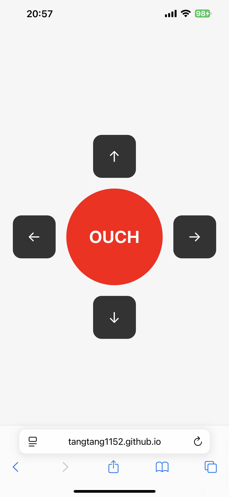
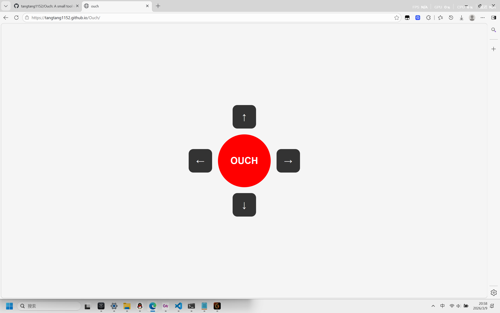

# ouch

A simple web tool for quickly expressing pain direction during a massage.

## Live Demo

https://tangtang1152.github.io/Ouch/

(Works on mobile browsers)

---

## Background

During a massage session, it can be difficult to precisely describe where the pain is strongest.

The painful point may shift quickly, and constantly saying  
"left", "a bit up", "no, more right" can interrupt the massage flow.

Sometimes the user cannot easily look at the phone or speak continuously.

This project explores a minimal interaction to communicate pain instantly.

---

## Idea

A simple interface with:

- one **large OUCH button** to signal pain
- four **direction buttons** to adjust the location
- **audio cues** to communicate quickly with the masseur

Layout:
    ↑

← OUCH →

    ↓

The goal is **fast, low-friction communication**.

---

## Features (MVP)

- Large center **OUCH button**
- Direction buttons: **up / down / left / right**
- Audio playback for each signal
- Mobile-friendly layout
- Works directly in a browser

---

## Demo

### Mobile

### Desktop

Example scenarios:

- lying face down during massage
- pain point shifting quickly
- quick signal without speaking

---

## Design Decisions

### Why not React for the first version?

The MVP only requires a few buttons and simple audio playback.

Using **plain HTML / CSS / JavaScript** keeps the setup minimal and allows faster validation of the interaction idea.

---

### Why start with click input?

Click input is:

- deterministic
- easy to debug
- reliable across devices

Motion / gyroscope interactions will be explored later after the core interaction is validated.

---

### Why start with Web instead of a mobile app?

A web version has:

- lower development overhead
- instant deployment
- easier sharing

Once the interaction model is proven, a mobile app could provide:

- better gesture detection
- hardware button integration
- vibration feedback

---

## Tech Stack

- HTML
- CSS
- JavaScript
- GitHub Pages (deployment)

---

## Project Structure
ouch
│
├── index.html
├── style.css
├── script.js
│
├── assets
│ ├── ouch.mp3
│ ├── up.mp3
│ ├── down.mp3
│ ├── left.mp3
│ └── right.mp3
│
└── README.md

---

## Roadmap

Possible future improvements:

- vibration feedback
- motion / tap detection
- customizable sound packs
- accessibility improvements
- usage testing in real massage sessions
- mobile app version

---

## Status

Current version: **v0.1**

- MVP completed
- deployed on GitHub Pages
- mobile layout tested

---

## Author

Created by **tangtang1152**